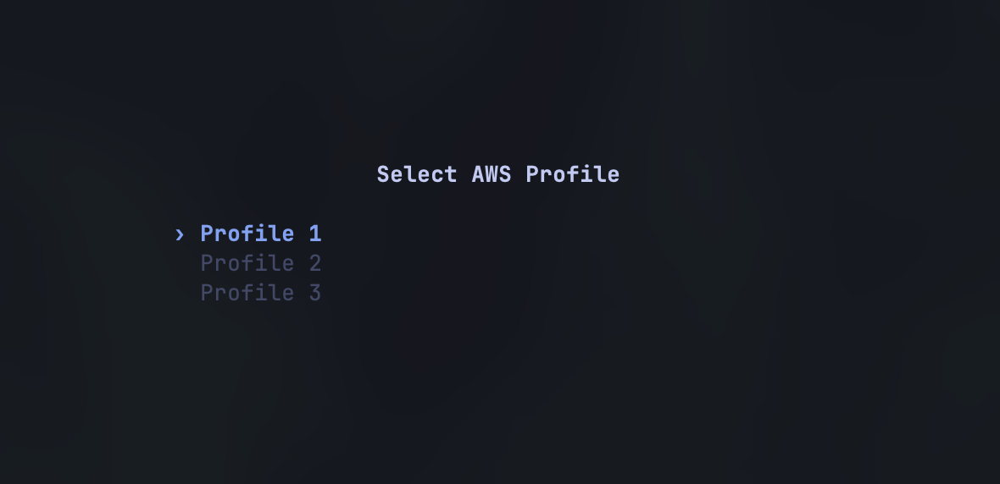

# awsm

> _pronounced "awesome"!_

A Vim based TUI for the AWS Console. You can view your AWS resources in a Neovim style interface, without leaving the terminal.


https://github.com/user-attachments/assets/980dc6e0-24d8-4ee0-8f5a-4dc995ad2ca9


## Install

### Homebrew

```bash
brew tap zeke-john/awsm
brew install awsm
```

### From source

```bash
git clone https://github.com/zeke-john/awsm.git
cd awsm
cargo install --path .
```

## Usage

```bash
awsm                          # pick your profile on open
awsm --profile staging        # skip picker and use a specific profile
awsm -p prod -r us-west-2     # set profile and region
```


awsm uses the standard AWS credential chain so if `aws cli` works, awsm should be ready to go. It also supports environment variables, `~/.aws/credentials`, SSO, and instance roles.



## Services

I tried to make each service match all the functionality of the AWS Console, but in a TUI format. Heres a quick overview of what you can do with each service:

| Service | What you get |
|-----|-------------|
| S3 | Buckets, object browser, prefix navigation, file preview, download, metadata |
| DynamoDB | Tables, items, query builder, index picker, filters, pagination, full JSON detail |
| Lambda | Functions, configuration, env vars, layers, tags, VPC info |
| CloudWatch | Log groups, streams, events, time range selector, Logs Insights queries |
| Secrets Manager | Secrets list, masked/revealed values, JSON pretty-print, rotation config |

Currently these are the only services available, but i do plan to add more in the future (SQS, ECS, Amplify, etc.)... If there is a specific service you would like to see, please open an issue or a PR so we can discuss!

## Keybindings

All of these are avilable w/ the help menu, which you can open with `?` from anywhere in the TUI

### Navigation

| Key | Action |
|-----|--------|
| `j` / `k` | Move down / up |
| `h` | Go back |
| `Enter` | Drill into selected item |
| `gg` / `G` | Jump to top / bottom |
| `Ctrl-d` / `Ctrl-u` | Half-page down / up |
| `Tab` | Toggle sidebar focus |
| `Ctrl-b` | Toggle sidebar visibility |
| `Esc` | Back / close popup / clear search |

### Actions

| Key | Action |
|-----|--------|
| `/` | Search / filter |
| `s` / `S` | Sort next / previous column |
| `x` | Toggle sort direction |
| `y` | Yank (copy) value to clipboard |
| `n` / `N` | Next page / previous page |
| `r` | Retry on error |
| `?` | Help |

### Service-specific

| Key | Context | Action |
|-----|---------|--------|
| `q` | DynamoDB items | Open query builder |
| `i` | DynamoDB items | Switch index |
| `X` | DynamoDB items | Clear query |
| `a` / `d` | DynamoDB query builder | Add / delete filter |
| `l` / `h` | DynamoDB items | Scroll columns |
| `+` / `-` | DynamoDB items | Resize columns |
| `0` | DynamoDB items | Reset column width |
| `Space` | CloudWatch groups | Select groups |
| `f` | CloudWatch groups | Search log group |
| `i` | CloudWatch groups | Open Logs Insights |
| `r` | CloudWatch | Refresh |
| `t` / `T` | CloudWatch events | Cycle time range |
| `d` | S3 file detail | Download to ~/Downloads |
| `s` | Secrets detail | Toggle secret value visibility |

### Commands

| Command | Action |
|---------|--------|
| `:q` | Quit |
| `:region us-west-2` | Switch region |
| `:profile staging` | Switch profile |

## License

MIT
